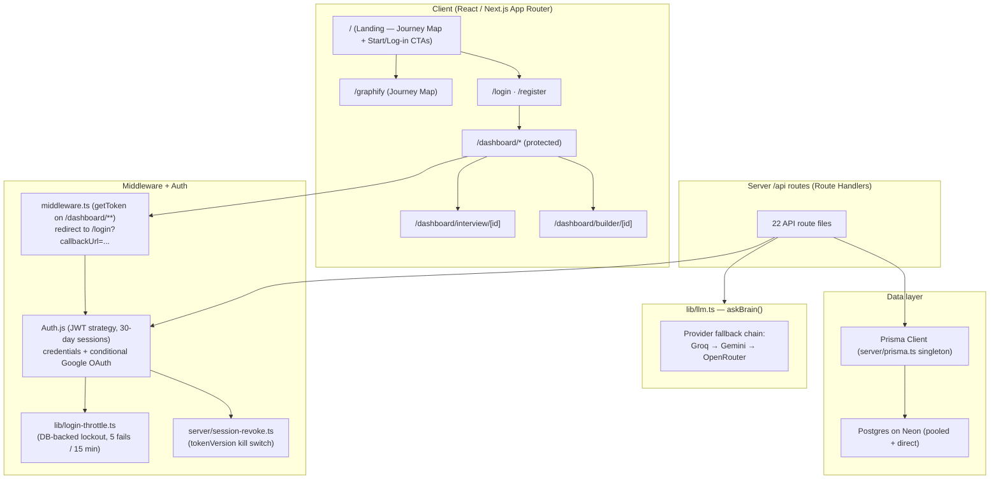
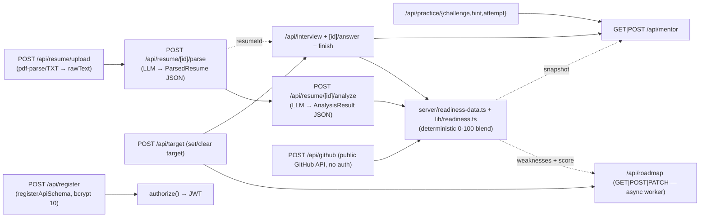
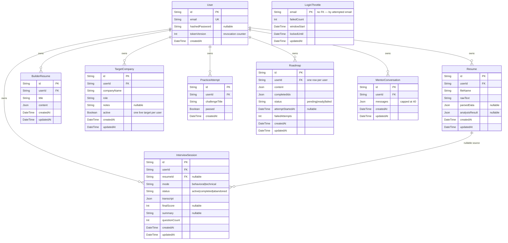
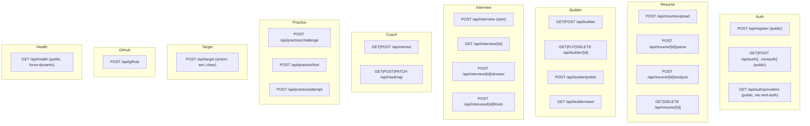
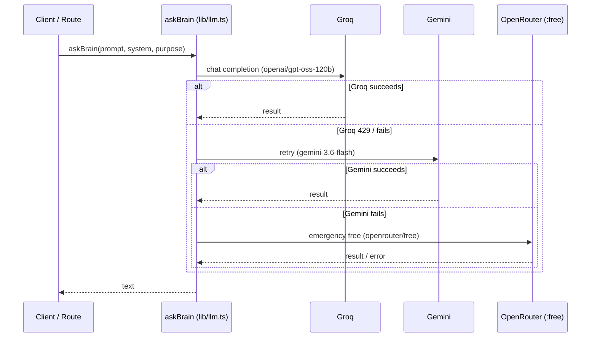

# PROJECT_GRAPH.md — CareerPilot dependency & architecture graph

This is the "graphified" visual map of the codebase. It mirrors the on-product
`/graphify` Journey Map (3D, 8 feature stops) in a static, greppable, Mermaid
form that lives with the source. Regenerate/extend it whenever a module, route,
or Prisma model changes (see the "keep it accurate" note at the bottom).

**This graph was rebuilt against the actual source tree (2026-09-16).** It
reflects the current schema (incl. `LoginThrottle`, `User.tokenVersion`,
Roadmap's async-generation columns), the 22 route handlers as they exist now,
the post-fix register flow (`registerApiSchema`), and the full module layer
(e.g. new `src/lib/login-throttle.ts`, `src/lib/company-type.ts`,
`src/lib/code-runner.ts`, `src/server/session-revoke.ts`).

---

## 1. Top-level architecture (Mermaid)



---

## 2. Feature flow (end-to-end walkthrough)



---

## 3. Module dependency graph (Mermaid)

```mermaid
graph LR
    subgraph Pages["src/app (pages)"]
        P_landing[page.tsx — landing = Journey Map + CTAs]
        P_graphify[graphify/page.tsx]
        P_dash[dashboard/page.tsx — server component]
        P_intv[dashboard/interview/[id]/page.tsx — client, voice]
        P_bldr[dashboard/builder/[id]/page.tsx]
        P_prog[dashboard/progress/page.tsx]
        P_mentor[dashboard/mentor/page.tsx]
        P_road[dashboard/roadmap/page.tsx]
        P_prac[dashboard/practice/page.tsx]
        P_tgt[dashboard/target/page.tsx]
        P_gh[dashboard/github/page.tsx]
        P_res[dashboard/resume/[id]/page.tsx]
        P_ivs[dashboard/interview/start/page.tsx]
    end

    subgraph Components["src/components"]
        C_jm[graphify/journey-map.tsx — Three.js scene]
        C_ud[resume-upload.tsx]
        C_rd[resume-detail.tsx]
        C_rl[resume-list.tsx]
        C_bld[builder/builder-editor.tsx + form/preview/polish/seed]
        C_ac[interview/answer-composer.tsx + voice-toggle]
        C_rh[readiness-hero.tsx + readiness-line-chart.tsx]
        C_rw[roadmap-widget.tsx]
        C_mc[mentor-chat.tsx]
        C_rv[roadmap-viewer.tsx]
        C_pw[practice-workspace.tsx]
        C_tp[target-picker.tsx + clear-target-button]
        C_ga[github-analyzer.tsx]
        UI[ui/button · card · input · label · textarea]
        Auth[auth/login-form · register-form · google-button · auth-banner · sign-out-button]
    end

    subgraph Lib["src/lib"]
        LLM[llm.ts — askBrain, provider chain]
        PROMPTS[prompts/* — one system+prompt pair per feature]
        VALIDATORS[validators/* — zod shared client/server]
        READINESS[readiness.ts — pure scoring fns]
        SPEECH[speech.ts — Web Speech wrapper]
        CODERUN[code-runner.ts — client-side Blob worker sandbox]
        COMTYPE[company-type.ts — deterministic classifier]
        THROTTLE[login-throttle.ts — lockout]
        AUTH_ERRS[auth-errors.ts — lockout sentinel]
        BSEED[builder-seed.ts — parsed → builder content]
        AUTHCFG[auth.ts — authOptions]
        UTILS[utils.ts]
    end

    subgraph ServerPkg["src/server"]
        PRISMA[prisma.ts — singleton client]
        SCONTEXT[student-context.ts — read-only snapshot]
        RDATA[readiness-data.ts — derived dataset]
        GHUB[github.ts — IP cache + rate-limit handling]
        SREVOKE[session-revoke.ts — revokeAllSessions]
    end

    P_landing --> C_jm
    P_graphify --> C_jm

    P_dash --> C_ud
    P_dash --> C_rd
    P_dash --> C_rl
    P_dash --> C_rh
    P_dash --> C_rw
    P_res --> C_rd
    P_ivs --> C_ac
    P_intv --> C_ac
    P_bldr --> C_bld
    P_mentor --> C_mc
    P_road --> C_rv
    P_prac --> C_pw
    P_tgt --> C_tp
    P_gh --> C_ga

    P_dash --> PRISMA
    P_dash --> RDATA
    P_dash --> AUTHCFG

    Components --> VALIDATORS
    Components --> Auth
    Components --> UI
    Components --> SPEECH
    C_pw --> CODERUN
    C_bld --> BSEED

    API_ROUTES[src/app/api/** — 22 route files]
    API_ROUTES --> ServerPkg
    API_ROUTES --> LLM
    API_ROUTES --> VALIDATORS
    API_ROUTES --> COMTYPE

    AUTHCFG --> THROTTLE
    AUTHCFG --> AUTH_ERRS
    THROTTLE --> PRISMA
    SREVOKE --> PRISMA
    SCONTEXT --> PRISMA
    SCONTEXT --> RDATA
    RDATA --> PRISMA
    GHUB --> LLM

    LLM --> PROMPTS
    PRISMA --> Neon[(Postgres on Neon)]
```

---

## 4. Database model graph (Prisma)



Notes:
- No session/account tables — sessions are **stateless 30-day JWTs**. `tokenVersion`
  on `User` is the only revocation kill switch (`server/session-revoke.ts` bumps it;
  the `session` callback in `lib/auth.ts` rejects any token whose `ver` is stale).
- Every user-scoped child model is `onDelete: Cascade` from `User`. `InterviewSession`
  → `Resume` uses `onDelete: SetNull`.
- `LoginThrottle` is keyed purely by attempted email (one shared Postgres row that
  survives serverless instance splits). No relation to `User`.

---

## 5. API route inventory (22 route files)



Every route except `register`, `auth/[...nextauth]`, and `health` runs
`getServerSession(authOptions)` and returns `{ error, code }` on failure
(`UNAUTHORIZED` | `VALIDATION_ERROR` | `NOT_FOUND` | `FORBIDDEN` | `DB_ERROR` | …).

---

## 6. The Brain (lib/llm.ts fallback chain)

Three OpenAI-compatible providers; a `429` is retried once after 2s, non-429
failures advance the chain, and only keyed providers are attempted.



---

## 7. Client → API flows (per component)

| Component (client) | Calls |
|---|---|
| `auth/register-form.tsx` | `POST /api/register`, then `signIn("credentials")` → `/dashboard` |
| `auth/login-form.tsx` | `signIn("credentials")` · `signIn("google")` |
| `auth/google-button.tsx` | `GET /api/auth/providers` (hide when unconfigured), `signIn("google")` |
| `dashboard/resume-upload.tsx` | `POST /api/resume/upload` |
| `dashboard/resume-detail.tsx` | `GET/POST/DELETE /api/resume/[id]`, `/parse`, `/analyze` |
| `dashboard/resume-list-item.tsx` | `DELETE /api/resume/[id]` |
| `builder/builder-editor.tsx` | `GET\|POST /api/builder`, `PUT /api/builder/[id]`, `POST /api/builder/polish` |
| `builder/seed-modal.tsx` | `GET /api/builder/seed`, `POST /api/builder { sourceResumeId }` |
| `interview/start-form.tsx` | `POST /api/interview` |
| `dashboard/interview/[id]/page.tsx` | `GET /api/interview/[id]`, `POST .../answer`, `POST .../finish` (+ `lib/speech.ts`) |
| `roadmap/roadmap-viewer.tsx` | `GET\|POST\|PATCH /api/roadmap` (polls while `pending`) |
| `mentor/mentor-chat.tsx` | `GET\|POST /api/mentor` |
| `practice/practice-workspace.tsx` | `POST /api/practice/challenge` · `/hint` · `/attempt` + `runCode()` (client worker) |
| `target/target-picker.tsx`, `clear-target-button.tsx` | `POST /api/target` (set / clear) |
| `github/github-analyzer.tsx` | `POST /api/github` |

---

## 8. Auth & session lifecycle (the part that keeps everyone out)

```mermaid
flowchart LR
    R["/api/register<br/>registerApiSchema<br/>bcrypt.hash 10"]
    L["/login<br/>signIn credentials — authorize()"]
    T["LoginThrottle row<br/>5 fails → lock 15 min"]
    J["JWT minted at sign-in<br/>payload: id + ver = tokenVersion"]
    M["/dashboard request"]
    MW["middleware.ts getToken<br/>(no token → /login?callbackUrl)"]
    S["session callback: read tokenVersion<br/>ver mismatch → signed-out session"]
    OK["user-scoped data / API"]

    R --> L
    L --> T
    T --> J
    M --> MW
    MW --> S
    S --> OK
    J ~. ver check .~> S
    Revoke["revokeAllSessions bumps tokenVersion"] -.> S
```

- Google OAuth is enabled **only when both `GOOGLE_CLIENT_ID` and
  `GOOGLE_CLIENT_SECRET` are set** (empty keys otherwise hard-crash `/api/auth/*`).
  Google sign-in upserts a `User` row via the `signIn` callback; credentials
  sign-in never does (authorize returns existing rows only).
- The lockout sentinel (`LOCKOUT_PREFIX`) is exported from `lib/auth-errors.ts`
  (constants-only, so the client `login-form` can import it without server code).
- The dashboard pages double-check the session server-side even though middleware
  already guards the route (defense in depth).

---

## 9. Security / platform decisions worth remembering

- **Middleware** (`src/middleware.ts`) matches `/dashboard` and `/dashboard/:path*`
  unconditionally; everything else (landing, /graphify, /login, /register) is public.
  Missing `NEXTAUTH_SECRET` denies all dashboard traffic in production.
- **LLM keys never reach the client**: `lib/llm.ts` is protected by `import
  "server-only"` (build-time failure if a client component imports it).
- **The coding-test sandbox is client-side** (`lib/code-runner.ts`): a Blob-injected
  Web Worker with a `fetch` shadow, a 5s kill via `worker.terminate()`, and no
  network. No server-side Judge0/Docker dependency (per RULES).
- **Readiness is deterministic** (`lib/readiness.ts`): resume 40% + interview 60%,
  derived in `server/readiness-data.ts`, never an LLM number.
- **Roadmap generation is a lazy GET worker** (`maxDuration = 60`, `attemptStartedAt`
  claim gate, `failedAttempts` cap of 3) because Vercel Hobby has no background jobs.
- **GitHub is a public, authless API** fetch (`server/github.ts`) with a 24h
  in-memory cache and typed `GitHubRateLimitError` → amber banner.
- **Mentor + roadmap read a deterministic snapshot** (`server/student-context.ts`),
  never mutate the student's learning data.

---

## 10. The on-product Journey Map (/graphify)

- The landing page (`src/app/page.tsx`) IS the Journey Map, with `Start free`
  (→ `/register`) and `Log in` (→ `/login`) CTAs; `/graphify` is the same component
  without CTAs (revisitable while signed in).
- 8 stops, each wired to a real dashboard route: **Roadmap**, **Resume Builder**,
  **Resume Analyzer**, **GitHub Analysis**, **Target Company**, **Coding Test**,
  **Mock Interview**, **Mentor Chat**.
- `journey-map.tsx` lazy-loads `three` in `useEffect` (out of first-load bundle,
  SSR-safe), paints graph-paper terrain + flags on canvas textures, honours
  `prefers-reduced-motion`, exposes an sr-only nav for screen readers/crawlers, and
  falls back to a flat stop list when WebGL is unavailable.
- Stop list must stay in sync with the feature flows in sections 2 and 7.

---

## Keep it accurate

- Source of truth: `prisma/schema.prisma` (models), `src/app/api/**` (routes), and
  `src/components|lib|server` (modules). Update this doc when any of those change.
- The live 3D render lives at `src/components/graphify/journey-map.tsx` (8 feature
  stops, listed in section 10). Its stop list should stay in sync with the flows.
- This graph was regenerated by reading the current source (2026-09-16), not copied
  from an earlier draft — treat every edge above as describing the tree as it is
  today.
- No external tooling is required to view the Mermaid blocks — GitHub, VS Code, and
  `mermaid-cli` all render them.